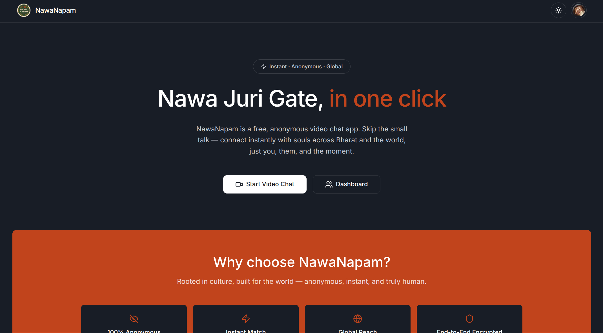
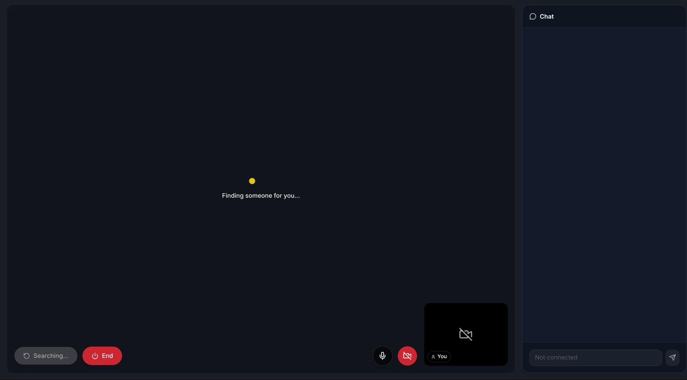
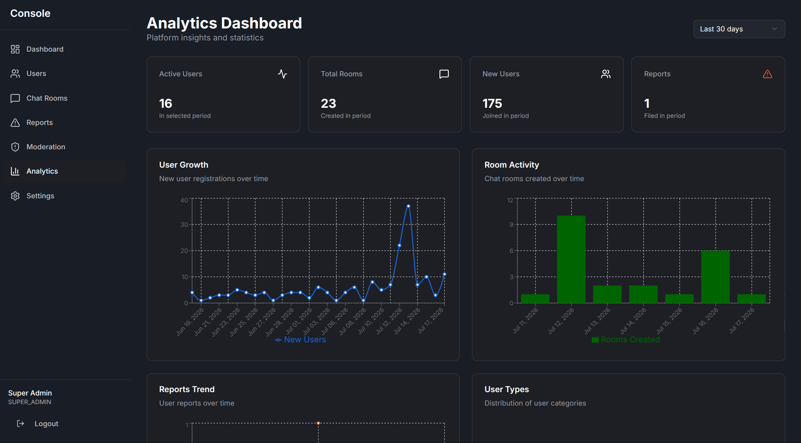
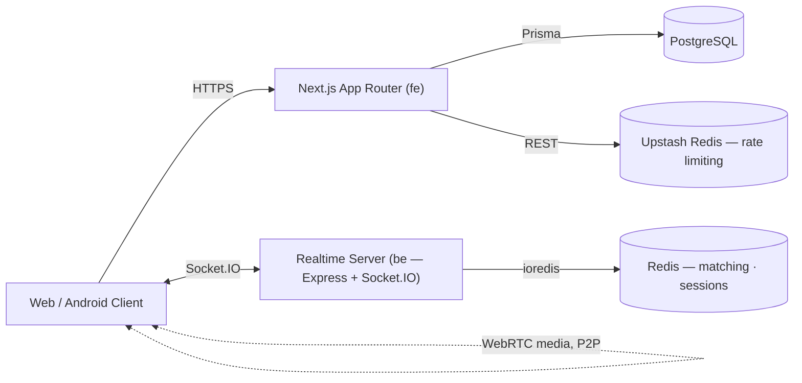

<div align="center">
  

  <h1>NawaNapam Core</h1>

  <p><strong>Instant, anonymous, one-on-one video chat — matched in seconds, protected by design.</strong></p>

  <p>
    A Next.js + Socket.IO platform for real-time, WebRTC-powered conversations between strangers,
    with no profile required and privacy built into every layer.
  </p>

  <p>
    <a href="https://github.com/NawaNapam/nawanapam-core/actions/workflows/ci.yml"></a>
    <a href="https://github.com/NawaNapam/nawanapam-core/actions/workflows/android-build.yml"></a>
    <a href="https://github.com/NawaNapam/nawanapam-core/releases"></a>
    <a href="https://github.com/NawaNapam/nawanapam-core/commits/main"></a>
    
    <a href="./LICENCE"></a>
  </p>

  <p>
    <a href="https://www.nawanapam.com"><strong>Website</strong></a> ·
    <a href="https://github.com/NawaNapam/nawanapam-core/releases/latest/download/nawanapam.apk"><strong>Download Android APK</strong></a> ·
    <a href="#getting-started"><strong>Getting Started</strong></a> ·
    <a href="#roadmap"><strong>Roadmap</strong></a>
  </p>
</div>

<br />

## Table of Contents

- [Overview](#overview)
- [Features](#features)
- [Screenshots](#screenshots)
- [Architecture](#architecture)
- [Tech Stack](#tech-stack)
- [Getting Started](#getting-started)
- [Environment Variables](#environment-variables)
- [Project Structure](#project-structure)
- [Android App](#android-app)
- [Security](#security)
- [API Overview](#api-overview)
- [Roadmap](#roadmap)
- [Contributing](#contributing)
- [Development Workflow](#development-workflow)
- [FAQ](#faq)
- [License](#license)

---

## Overview

**NawaNapam** connects two strangers over live video with no sign-up friction — an anonymous session is enough to start talking. The platform pairs users in real time, negotiates a peer-to-peer WebRTC call for media, and layers in text chat, moderation tooling, and mobile delivery via a native Android wrapper.

This repository is the **core monorepo**: a Next.js frontend, an Express/Socket.IO realtime backend, and the Capacitor project that ships the Android app. It exists to give NawaNapam's team a single, coherent codebase for the web app, the matching/signaling server, and the admin console that keeps the platform safe to use.

> Access to this repository and its source is governed by the [LICENCE](./LICENCE) — see [License](#license) below.

## Features

<table>
<tr>
<td valign="top" width="50%">

### 🎥 Real-Time Communication
- HD peer-to-peer video and audio via WebRTC
- Live text chat alongside the video session
- Sub-3-second match-to-connect time
- Socket.IO signaling with heartbeat-based liveness checks

### 🎯 Matching
- Gender-based preference filtering (random / male / female)
- Redis-backed queue for low-latency pairing
- Automatic re-match on skip or disconnect

### 🔑 Authentication & Identity
- Anonymous sessions — no profile required to start
- Email/OTP and Google OAuth via NextAuth.js
- Native login/signup flows for the Android app

### 🛡️ Moderation & Trust
- In-app reporting with a dedicated review queue
- Moderation logs and user banning
- Admin console with analytics and room oversight

</td>
<td valign="top" width="50%">

### 📱 Mobile
- Capacitor-wrapped Android app backed by the production site
- Push notifications, native share, and status bar integration
- Signed release builds via CI on tag push

### ⚡ Performance & PWA
- Installable Progressive Web App with offline support
- Turbopack-powered builds and edge-optimized rendering
- Background sync and push notifications (in progress)

### 🔒 Security
- CSRF protection, Helmet security headers, strict CSP
- Redis-backed rate limiting on APIs and auth routes
- Zod + express-validator input validation, bcrypt hashing

### 🧭 Admin Console
- Dashboard, analytics, and user management
- Reports, moderation logs, and room inspection
- Role-scoped admin sessions, separate from user auth

</td>
</tr>
</table>

## Screenshots

<!--
  Add screenshots to a `docs/screenshots/` directory and update the paths below.
  Keeping these as lightweight placeholders keeps the README fast-loading until real assets are added.
-->

<div align="center">

| Landing | Video Chat | Admin Console |
|:---:|:---:|:---:|
|  |  |  |

</div>

## Architecture



- **fe** (Next.js) serves the UI, handles auth, and exposes API routes backed by PostgreSQL via Prisma.
- **be** (Express + Socket.IO) owns matching, chat relay, and WebRTC signaling, using Redis for queue state and session liveness.
- Once matched, video/audio flows **directly between clients** over WebRTC — the server never touches call media.
- A background worker (`be/src/workers/retryPersist.ts`) drains a Redis stream to durably persist call/session data with retry and backoff.

## Tech Stack

| Layer | Technology |
|---|---|
| Frontend framework | Next.js 15 (App Router, Turbopack), React 19, TypeScript |
| Styling / UI | Tailwind CSS v4, Radix UI primitives, Framer Motion |
| State & forms | Zustand, React Hook Form, Zod |
| Auth | NextAuth.js (Prisma adapter), Google OAuth, bcryptjs |
| Database | PostgreSQL, Prisma ORM |
| Realtime backend | Node.js, TypeScript, Express 5, Socket.IO |
| Cache / matching store | Redis (`ioredis`), Upstash Redis (rate limiting) |
| Media | WebRTC, Cloudinary |
| Email | Resend, React Email |
| Push notifications | Firebase Admin, Capacitor Push Notifications |
| Mobile | Capacitor 8 (Android) |
| Hosting / CI | Vercel, GitHub Actions, Docker Compose (local Postgres) |

## Getting Started

### Prerequisites

| Requirement | Version |
|---|---|
| Node.js | 20+ (22+ if building the Android app) |
| PostgreSQL | 15+ |
| Redis | 6+ |
| Java | 21 (Android builds only) |

### 1. Clone

```bash
git clone git@github.com:NawaNapam/nawanapam-core.git
cd nawanapam-core
```

### 2. Database (local)

```bash
docker compose up -d   # starts PostgreSQL on localhost:5432
```

### 3. Backend

```bash
cd be
npm install
touch .env   # populate the values, see Environment Variables below
npm run dev
```

### 4. Frontend

```bash
cd fe
npm install
touch .env   # populate the values, see Environment Variables below
npx prisma generate
npx prisma migrate dev
npm run dev
```

### 5. Open the app

- Frontend — `http://localhost:3000`
- Backend — `http://localhost:8080`

### Production build

```bash
# Frontend
cd fe && npm run build && npm start

# Backend
cd be && npm run build && npm start
```

## Environment Variables

### Frontend (`fe/.env`)

| Variable | Required | Description |
|---|:---:|---|
| `DATABASE_URL` | ✅ | PostgreSQL connection string |
| `NEXTAUTH_URL` | ✅ | Canonical app URL used by NextAuth |
| `NEXTAUTH_SECRET` | ✅ | NextAuth session secret (32+ chars) |
| `UPSTASH_REDIS_REST_URL` | ✅ | Upstash Redis REST endpoint (rate limiting) |
| `UPSTASH_REDIS_REST_TOKEN` | ✅ | Upstash Redis REST token |
| `NEXT_PUBLIC_SIGNALING_URL` | ✅ | URL of the backend Socket.IO server |
| `GOOGLE_CLIENT_ID` / `GOOGLE_CLIENT_SECRET` | – | Google OAuth credentials |
| `RESEND_API_KEY` | – | Transactional email (welcome, OTP, admin alerts) |
| `CLOUDINARY_CLOUD_NAME` / `CLOUDINARY_API_KEY` / `CLOUDINARY_API_SECRET` | – | Media uploads |
| `FIREBASE_PROJECT_ID` / `FIREBASE_CLIENT_EMAIL` / `FIREBASE_PRIVATE_KEY` | – | Push notification delivery |
| `NEXT_SHARED_SECRET` | – | Shared secret for trusted fe ↔ be requests |
| `NODE_ENV` | – | `development` \| `production` \| `test` |

### Backend (`be/.env`)

| Variable | Required | Description |
|---|:---:|---|
| `PORT` | – | HTTP/Socket.IO port (default `8080`) |
| `REDIS_HOST` / `REDIS_PORT` | – | Redis connection (or use `REDIS_URL`) |
| `REDIS_PASSWORD` / `REDIS_USERNAME` / `REDIS_TLS` | – | Redis auth and TLS options |
| `STALE_MS` | – | Idle-session timeout used by the match handler |
| `NEXT_SHARED_SECRET` | – | Must match the frontend's shared secret |

> Additional tuning variables (`STREAM_*`, `HTTP_TIMEOUT_MS`, `INITIAL_BACKOFF_MS`, `MAX_BACKOFF_MS`) configure the retry-persist worker's Redis stream consumer — sensible defaults are used if unset.

## Project Structure

```
nawanapam-core/
├── be/                        # Realtime backend (Express + Socket.IO)
│   ├── src/
│   │   ├── socket/            # matchHandler, rtchandler, chatHandlers, authHandler…
│   │   ├── services/          # socket.service.ts
│   │   ├── workers/           # retryPersist.ts — durable session persistence
│   │   └── utils/redis/       # Lua scripts for atomic matching ops
│   └── redis/scripts/
│
├── fe/                         # Frontend application (Next.js)
│   ├── src/
│   │   ├── app/
│   │   │   ├── (routes)/       # Public + auth routes
│   │   │   ├── (general)/      # Static pages (privacy, terms, founders…)
│   │   │   ├── console/        # Admin dashboard, moderation, reports, analytics
│   │   │   └── api/            # Next.js API routes
│   │   ├── components/         # custom/, ui/, admin/, native/
│   │   ├── hooks/               # useWebRTC, useRoomChat, SocketProvider…
│   │   ├── lib/                 # security, rate-limit, email, env-validation
│   │   ├── services/             # auth, notifications, share, storage
│   │   └── stores/                # Zustand stores
│   ├── prisma/schema.prisma
│   └── android/                    # Capacitor Android project
│
├── .github/workflows/                # CI + Android build pipelines
└── docker-compose.yml                 # Local PostgreSQL
```

## Android App

`fe/android` is a [Capacitor](https://capacitorjs.com/) native wrapper pointed at the production site (`https://www.nawanapam.com`), so building the APK does **not** require a local Next.js build.

- **Debug builds** — every push/PR touching `fe/**` builds a debug APK, downloadable from that commit's [Actions run](https://github.com/NawaNapam/nawanapam-core/actions/workflows/android-build.yml) under **Artifacts**.
- **Signed releases** — pushing a tag matching `android-v*` (e.g. `android-v1.0.0`) builds a signed release APK and publishes it as a GitHub Release asset.

<details>
<summary><strong>Enable signed release builds</strong></summary>

Release builds are signed using an environment-driven `signingConfig` in [`fe/android/app/build.gradle`](fe/android/app/build.gradle) — it's a no-op unless all four secrets are present, so debug builds are unaffected.

Add these repository secrets (**Settings → Secrets and variables → Actions**):

| Secret | Value |
|---|---|
| `ANDROID_KEYSTORE_BASE64` | `base64 -w0 release.keystore` output |
| `ANDROID_KEYSTORE_PASSWORD` | keystore password |
| `ANDROID_KEY_ALIAS` | key alias |
| `ANDROID_KEY_PASSWORD` | key password |

```bash
git tag android-v1.0.0
git push origin android-v1.0.0
```

</details>

<details>
<summary><strong>Build & install locally</strong></summary>

```bash
cd fe
npm install
npx cap sync android

cd android
./gradlew assembleDebug   # or assembleRelease with the env vars above set

adb install -r app/build/outputs/apk/debug/app-debug.apk
```

Without `adb`, transfer the APK to the device and open it from a file manager, allowing **"Install unknown apps"** when prompted.

</details>

## Security

| Layer | Implementation |
|---|---|
| Transport | HSTS, strict CSP, and standard security headers via `next.config.ts` |
| CSRF | Edge CSRF tokens on state-changing forms |
| Rate limiting | Upstash Redis — tiered limits for API, auth, and sensitive routes; `express-rate-limit` on the backend |
| Input validation | Zod schemas (frontend), `express-validator` (backend), DOMPurify HTML sanitization |
| Passwords | bcrypt hashing, strong-password policy |
| Sessions | Secure, cookie-based via NextAuth; separate `Admin` / `AdminSession` models for the console |
| API hardening | Method + content-type validation, origin verification, constant-time comparisons, request size limits |
| Backend | Helmet security headers, CORS allow-listing |

## API Overview

The frontend exposes Next.js API routes under `fe/src/app/api/` for auth, user profile/settings, and admin operations (reports, moderation, analytics) — scoped by session role and rate-limited per route. The realtime backend does not expose REST endpoints; it communicates entirely over **Socket.IO events**:

| Namespace | Responsibility |
|---|---|
| `auth` | Session handshake and identity verification |
| `match` | Queueing and pairing users by preference |
| `rtc` | WebRTC offer/answer/ICE signaling relay |
| `chat` | In-session text messages |
| `heartbeat` | Liveness detection and stale-session cleanup |

Full endpoint-level documentation is intentionally out of scope here — read the relevant handler in `be/src/socket/` or `fe/src/app/api/` for exact contracts.

## Roadmap

- [ ] Group video chat (3+ people)
- [ ] Screen sharing
- [ ] Virtual backgrounds
- [ ] Gifts and reactions
- [ ] Advanced filtering (interests, location)
- [ ] AI-assisted moderation
- [ ] End-to-end encrypted calls
- [ ] Voice-only mode
- [ ] Consent-based session recording

## Contributing

1. Create a branch from `main`: `git checkout -b feature/short-description`
2. Make focused commits using [Conventional Commits](https://www.conventionalcommits.org/) style (`feat:`, `fix:`, `chore:`, …)
3. Ensure `npm run lint` and `npm run build` pass in `fe/`, and `npm run build` passes in `be/`
4. Open a pull request describing the change and its motivation
5. Address review feedback — CI (`ci.yml`, `android-build.yml` where relevant) must be green before merge

Contribution access to this repository is granted per the terms of the [LICENCE](./LICENCE).

## Development Workflow

- `main` is the protected, deployable branch — Vercel deploys the frontend from it automatically.
- Feature and fix branches merge via pull request; direct pushes to `main` are discouraged.
- `.github/workflows/ci.yml` lints and builds both `fe` and `be` on every push/PR.
- `.github/workflows/android-build.yml` builds a debug APK on `fe/**` changes and a signed release APK on `android-v*` tags.

## FAQ

<details>
<summary><strong>Is NawaNapam Core open source?</strong></summary>
<br />
No. The repository is source-available to authorized contributors under a proprietary license — see <a href="./LICENCE">LICENCE</a>.
</details>

<details>
<summary><strong>Does video/audio pass through the server?</strong></summary>
<br />
No. The backend only performs WebRTC signaling (offer/answer/ICE exchange). Media streams flow peer-to-peer between clients.
</details>

<details>
<summary><strong>Do I need Redis and PostgreSQL to run this locally?</strong></summary>
<br />
Yes — PostgreSQL backs persistent data (users, rooms, reports) via Prisma, and Redis backs matching, session state, and rate limiting.
</details>

<details>
<summary><strong>Can I build the Android app without a signing key?</strong></summary>
<br />
Yes. Debug builds (<code>assembleDebug</code>) don't require signing secrets — those are only needed for signed <code>android-v*</code> release builds.
</details>

## License

This project is licensed under a **Proprietary Internal-Use License** — see [LICENCE](./LICENCE) for full terms. Use, modification, and distribution are restricted to parties explicitly authorized by the copyright holder.

---

<div align="center">

Built by the NawaNapam team · [nawanapam.com](https://www.nawanapam.com)

<sub>© 2026 NawaNapam. All rights reserved.</sub>

</div>
